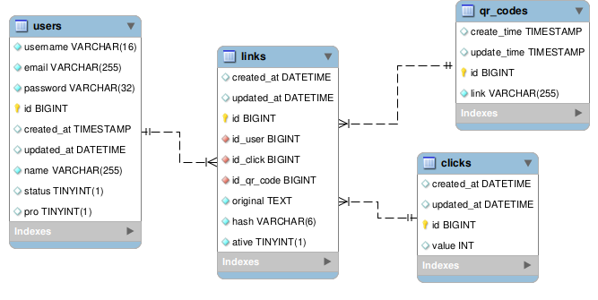

# Encurtador de links

## Acesso

#### URL 

- https://url-shorting-7jko.onrender.com

## Frontend

### Tecnologias

- TypeScript
  - Next.js
  - Tailwind CSS 

### Telas

- Login
- Cadastro
- Redirect
- Main Page
- Perfil

## Backend

### Tecnologias

- Golang
  - Gin-gonic
  - Golang-jwt
  - Google-Uuid
  - GoValidator
  - GoDotenv
  - Crypto
  - Postgres
  - Gorm
- Postgres

### Routers

Metodo | rota | descrição
---  | --- | ---
POST | /users/singin | Se logar na rede
POST |  /users/singup | Se cadastrar
GET | /users/:username | Pesquisar usuário
PATCH | /users/:username | Alterar usuário
POST | /link | Criar link
GET | /link | Buscar todos link
GET | /link/:hash | Buscar um link
PATCH | /link/:hash | Atualizar um link
DELETE | /link/:hash | Deletar um link
PATCH | /link/:hash/click | Atualizar a quantidade de clicks 

### Tabelas

- users
- qrcodes
- clicks
- links

### Schema

### API Externas

- Gerar QR Code
  - url: https://api.qrserver.com/v1/create-qr-code/?size=150x150&data=Example
